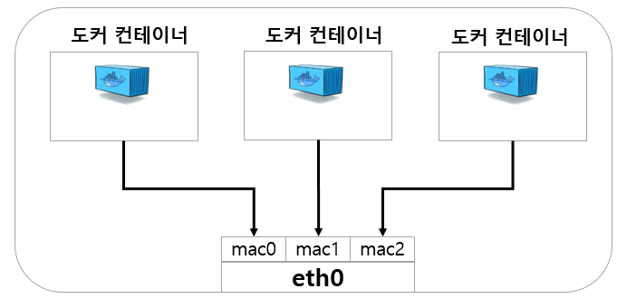
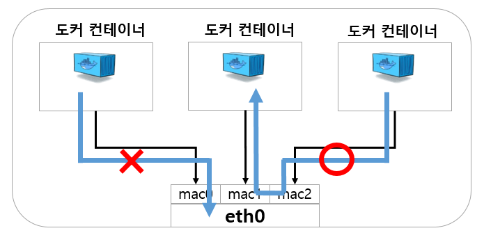

ref <br/>
: https://darkened-horn-f7b.notion.site/ubuntu-Image-8bec2a0daf684a8f96a6172bf299bbba (인선씨 노션)

### 1. Download Image

```bash
    $ docker pull ubuntu:jammy
```

### 2. Container run (다운로드 받은 Image 이용해서)

```bash
    $ docker run -it -d --privileged --name ubuntu_test ubuntu:jammy /bin/bash
    or
    $ docker run -it -d --privileged --name ubuntu_test ubuntu:jammy /sbin/init
```

ref <br/>
: https://cornswrold.tistory.com/499 <br/>
: https://watch-n-learn.tistory.com/28 <br/>
: https://wooono.tistory.com/348 <br/>
: https://khj93.tistory.com/entry/Docker-Docker-option-%EB%AA%85%EB%A0%B9%EC%96%B4-%EB%AA%A9%EB%A1%9D <br/>
: https://pyrasis.com/book/DockerForTheReallyImpatient/Chapter20/28

docker option 
 - -i : --interactive=false: 표준 입력(stdin)을 활성화하며 컨테이너와 연결(attach)되어 있지 않더라도 표준 입력을 유지합니다. 보통 이 옵션을 사용하여 Bash에 명령을 입력합니다. 
 - -d : --detach=false: Detached 모드입니다. 보통 데몬 모드라고 부르며 컨테이너가 백그라운드로 실행됩니다. 보통 데몬 모드라고 부르며, 컨테이너가 백그라운드로 실행됩니다.
 - -t : --tty=false: TTY 모드(pseudo-TTY)를 사용합니다. Bash를 사용하려면 이 옵션을 설정해야 합니다. 이 옵션을 설정하지 않으면 명령을 입력할 수는 있지만 셸이 표시되지 않습니다. 
 - --privileged : --privileged=false: 컨테이너 안에서 호스트의 리눅스 커널 기능(Capability)을 모두 사용합니다.
 - --name : 컨테이너 이름을 설정합니다.
 - -v: --volume: 데이터 볼륨을 설정입니다. 호스트와 컨테이너의 디렉토리를 연결하여, 파일을 컨테이너에 저장하지 않고 호스트에 바로 저장합니다. (마운트)
    + <컨테이너 디렉토리> : ex) -v /data
    + <호스트 머신 디렉토리>:<컨테이너 디렉토리> : ex) -v /data:/data
    + <호스트 머신 디렉토리>:<컨테이너 디렉토리>:<ro, rw> : ex) -v /data:/data:ro
    + <호스트 머신의 파일>:<컨테이너의 파일> : ex) -v /var/run/docker.sock:/var/run/docker.sock
 - -w: --workdir: 컨테이너 안의 프로세스가 실행될 디렉터리를 설정합니다.


### 3. macvlan을 통한 네트워크 연결

ref : https://m.blog.naver.com/PostView.naver?isHttpsRedirect=true&blogId=alice_k106&logNo=220984112963 

<center>
</img>
</center>

macvlan은 당연히 브릿지가 없다. 대신 서브 인터페이스(sub-interface) 라는 개념이 새롭게 등장한다. 일단 호스트 머신에 물리 장비 NIC인 eth0은 당연히 존재한다. 그럼 eth0에서 여러 개의 하위 인터페이스를 만듦으로써 동시에 여러 개의 맥 주소를 가질 수 있도록 구축한다. 그리고 나서 그 서브 인터페이스에 여러 개의 컨테이너들이 주렁주렁 달리면서 VLAN을 구성할 수 있게 된다.1  즉, macvlan 이라는 이름이 암시하듯이, 하나의 네트워크 인터페이스 카드를 가상화함으로써 여러 개의 맥주소를 양산하는 것이다.

<center>
</img>
</center>

macvlan Bridge 방식을 간단히 설명하면 위와 같다. 요약하자면, "(1) 호스트와는 통신이 안되지만, (2) 다른 서브 인터페이스간 통신은 되는" 방식이다. 원래 (1)은 macvlan에서 안되는거고, (2) 에서 다른 방식들과의 차이를 갖는다고 볼 수 있다. 이 방식은 부모 인터페이스에 간단한 브릿지를 둬서 다른 서브 인터페이스로 향하는 트래픽을 밖으로 내보내지 않고 바로 전달하는 방식이라고 한다. 모든 서브 인터페이스의 맥 주소를 aware 한 상태이기 때문에 브릿지에서의 Mac Learning 작업도 필요 없고, 루핑을 방지하기 위한 STP 알고리즘도 필요가 없다고 한다.

ref  <br/>
: https://velog.io/@dev_juloaa43/%EC%84%9C%EB%B8%8C%EB%84%B7%EB%A7%88%EC%8A%A4%ED%81%AC-24%EB%9E%80-%EB%AC%B4%EC%8A%A8-%EB%9C%BB%EC%9D%BC%EA%B9%8C <br/>
: https://imweb.me/blog?idx=102

IP 주소 뒤에 /24 /16 같은 숫자는 CIDR(사이더)라는 표기법을 쓴 것입니다. <br/>
IP 주소 딱 하나만 이야기할 때는 1.1.1.1처럼 말하면 됩니다. <br/>

subnet

192.168.1.0/24 => 192.168.1.0 ~ 192.168.1.255
192.168.1.0/32 => 192.168.1.0


### 3.1 컨테이너에 네트워크 연결

아래 parent 에 넣는 인자

linux : 에서 ifconfig 를 통해서 실제 NIC 장치 <br/>
macOS : eth0 로 입력... (ifconfig 를 통해서 보이는 실제 NIC장치로 보이는 en0입력 하면 안된다고 에러 뜸 ) <br/>
win   : 안해봄... <br/>

```bash
    $ docker network create -d macvlan --subnet=192.168.0.0/24 --gateway=192.168.0.1 -o parent=enp0s31f6 mac0

    (check)
    $ docker network ls
    >>>
    NETWORK ID     NAME      DRIVER    SCOPE
    dbd51773a842   bridge    bridge    local
    679b06c2e771   host      host      local
    f336237b7f2f   mac0      macvlan   local
    efff5f364cba   none      null      local

    (host machine 에서의 ifconfig)
    >>>
    명령어 전후로 바뀐게 없음.
```
```bash    
    $ docker network connect --ip=192.168.0.47 mac0 ubuntu_test
                                                |         |
                                         (network name) (contaion name)

    (연결된거 확인)
    $ docker network inspect mac0
    >>>
    {
        "Name": "mac0",

        ...

        "Containers": {
            ...
            "Name": "ubuntu_test",
            ...


    }

    (네트워크로부터 컨테이너 연결 해제)
    $ docker network disconnect mac0 one

    (--network (=--net) option 을 통해 바로 연결할 네트워크 지정)
    $ docker run -itd --name container_name --network mac0 image_name
    >>> 이렇게 하면 ip 는 서브넷 설정에 의해 ip 자동 설정.

    (ref : https://bug41.tistory.com/entry/Docker-%EC%BB%A8%ED%85%8C%EC%9D%B4%EB%84%88-%EA%B3%A0%EC%A0%95-IP-%EC%A7%80%EC%A0%95%ED%95%98%EB%8A%94%EB%B2%95-%EB%8F%84%EC%BB%A4-%EC%BB%A8%ED%85%8C%EC%9D%B4%EB%84%88-IP%EB%B3%80%EB%8F%99-%EB%8F%84%EC%BB%A4-%EB%84%A4%ED%8A%B8%EC%9B%8C%ED%81%AC)
    (고정 ip 되나?)
    $ docker run --restart="always" -itd --net mybridge --ip 172.20.0.4 -p 8888:80 -v /var/www/html/test:/var/www/html --name 컨테이너명 centos8_ap2

    $ docker run -it -d --privileged --net mac0 --ip=192.168.0.49 --name ubuntu_test ubuntu:jammy /bin/bash 
    >>
    고정 됨.!
   
```

### 3.2 컨테이너 간 네트워크 연결 확인

ref : https://www.daleseo.com/docker-networks/

```bash
    ('one' 컨테이너에서 'two' 컨테이너를 상대로 ping 테스트)
    $ docker exec one ping two


```

### 4. 필수 패키지 설치

```bash
    $ apt update
    $ apt install -y net-tools iputils-ping iproute2 git python3 python-is-python3 wget

    (ssh server)
    $ apt install -y openssh-server
    $ sudo /etc/init.d/ssh start

    (github cli 설치, (비공개된 서브모듈 설치시 필요))
    (ref : https://dev-gp.tistory.com/96)
    $ apt-key adv --keyserver keyserver.ubuntu.com --recv-key C99B11DEB97541F0
    $ apt-add-repository https://cli.github.com/packages
    $ apt update
    $ apt install gh  # 위 에 굳이 등록안해도 되네?
```

```bash
    (gh login - 깃허브 계정에서 '설정'-'개발자 설정'-'개인 적급 토큰'-'토큰 (클래식)' 에서의 토큰 값 필요 한번 발급한 코드는 다시는 안보여줌 새로 생성해야함)
    (ref : https://medium.com/@alexander.sirenko/using-github-access-token-with-submodules-5038b6d639e8)
    $ gh auth login
        ? What account do you want to log into? GitHub.com
        ? What is your preferred protocol for Git operations? HTTPS
        ? Authenticate Git with your GitHub credentials? Yes
        ? How would you like to authenticate GitHub CLI? Paste an authentication token                                                                                                                      Tip: you can generate a Personal Access Token here https://github.com/settings/tokens                                                                                                               The minimum required scopes are 'repo', 'read:org', 'workflow'.                                                                                                                                     ? Paste your authentication token: ****************************************                                                                                                                         - gh config set -h github.com git_protocol https
        ✓ Configured git protocol
        ✓ Logged in as a-sirenko
```