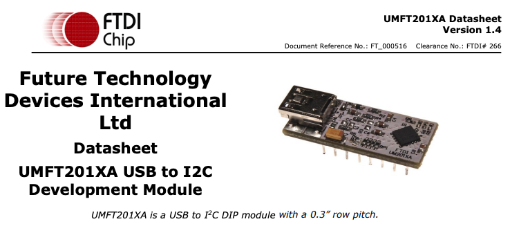

### FT201

<br/>
<center>
</img>
</center>


## 1. FT201 드라이버 macOS에 설치하기

https://www.youtube.com/watch?v=Ir2PVz1870E

## 1.1. 드라이버 복사

https://ftdichip.com/drivers/d2xx-drivers/

에서 D2XX Deiver 탭에서 MacOS X 10.4 Tiger or Later 행에서 ARM 아키택쳐에 있는 버전 클릭하여 다운

다운받은 압축파일 해제 후,

./D2XX_Driver/build 에 있는 libftd2xx.1.4.24.dylib 드라이버 라이브러리가 있는지 확인.

해당 파일을 /usr/local/lib 폴더에 복사, 해당 폴더가 없다면 관리자 권한으로 생성

아래와 같이 심볼링 링크 생성

```bash
    $ cd /usr/local/lib
    $ sudo ln -sf libftd2xx.1.4.24.dylib libftd2xx.dylib
```

/usr/local/include 폴더에 ftd2xx.h 파일 복사, 해당 폴더가 없다면 관리자 권한으로 생성

## 1.2. 컴파일시 옵션??

-lftd2xx ?

## 1.3. sample code 빌드?

```
    $ cd ftdi-umft201xa-test/D2XX_Driver/Samples 
    $ make
```

## 1.4. 장비 연결 후, 인식했는지 확인 (2024/02/23 아래 성공)

mac 프로그램으로 system information (시스템 정보) 검색해서 실행

하드웨어 - USB 하위에 UMFT201XA 인식 되었는지 확인


```
    UMFT201XA:

    제품 ID:	0x6015
    공급업체 ID:	0x0403  (Future Technology Devices International Limited)
    버전:	10.00
    일련 번호:	FT1VO3T7
    속도:	최대 12Mb/초
    제조업체:	FTDI
    위치 ID:	0x00112220 / 15
    사용 가능한 전류량(mA):	500
    필요한 전류량(mA):	90
    추가 동작 전류(mA):	0

```

```bash
    # ??
    sudo kextunload -b com.apple.driver.AppleUSBFTDI

    # 소스파일 Samples 내부에서 다음 시작
    release/Samples $ make
    release/Samples $ cp ../build/libftd2xx.1.4.24.dylib .
    release/Samples $ sudo ln -sf libftd2xx.1.4.24.dylib libftd2xx.dylib

    # 실행
    release/Samples $ sudo EEPROM/read/read

    >>>
    Library version = 0x10424
    Opening port 0
    FT_Open succeeded.  Handle is 0x148809a00
    FT_GetDeviceInfo succeeded.  Device is type 9.
    FT_EE_Read succeeded.

    Signature1 = 0
    Signature2 = -1
    Version = 0
    VendorId = 0x0403
    ProductId = 0x6015
    Manufacturer = 
    ManufacturerId = 
    Description = 
    SerialNumber = 
    MaxPower = 90
    PnP = 1
    SelfPowered = 0
    RemoteWakeup = 0
    Returning 0
```


## 1B. 다른 시도

https://www.qlcplus.org/forum/viewtopic.php?t=8852

```
    1) Download FTDI driver controller (this disables and enables and provides status of Apples FTDI driver) - http://www.dmxis.com/release/FtdiDriverControl.zip
    2) Download FTDI drivers - http://www.ftdichip.com/Drivers/D2XX/Ma ... X1.2.2.dmg
    3) Run FTDI driver controller and disable Apples FTDI driver
    4) Open FTDI driver file- D2XX1.2.2.dmg
    5) Drag D2XX & LibTable to desktop
    6) Open a Terminal window
    7) sudo mkdir /usr/local/lib
    8) sudo mkdir /usr/local/include
    9) sudo cp Desktop/D2XX/bin/libftd2xx.1.2.2.dylib/usr/local/lib/libftd2xx.1.2.2.dylib
    10) sudo ln -sf /usr/local/lib/libftd2xx.1.2.2.dylib/usr/local/lib/libftd2xx.dylib
    11) sudo cp Desktop/D2XX/Samples/ftd2xx.h/usr/local/include/ftd2xx.h
    12) sudo cp Desktop/D2XX/Samples/WinTypes.h/usr/local/include/WinTypes.h
    13) Plug in usb DMX interface. I my case a ultraDMX Micro.
    14) Open QLC+
    15) Goto inputs/outputs and next to DMX USB you'll see your device ready to configure

    Steps 5-12 are in the read me file. But there are spaces where there shouldn't be so you can't just cut and past in terminal from the read me file.
```


## 1.C 다른시도

https://learn.sparkfun.com/ftdiDriversMac

https://www.ftdichip.com/Support/Documents/InstallGuides/Mac_OS_X_Installation_Guide.pdf


## 1.D 다른시도

https://arduino.stackexchange.com/questions/91111/how-to-install-ftdi-serial-drivers-on-mac


```
    I have just managed to get the FTDI set up for my M1 mac using the Pro Mini. I think the issue is that newer macs automatically block the FTDI serial connection from being used as a com port. You need to install a program called D2XXHelper to prevent this behaviour.

    I did the following, hopefully this will work for you too:

    Install FTDI VCP Driver, found here: Scroll down to first table and find the latest Mac OS drivers. There are 2, the 2.4.4 version and the 1.5 version. I think you need to use the 1.5 version for the M1 but I’m not sure because I installed both before I did the next steps to get it working.
    Install the D2XXHelper found here: Scroll down to first table and look in the comments column for the Mac OS row to find the download link.
    After installing the D2XXHelper, you should get a security prompt saying system extension blocked. Follow this guide which shows how to provide permission for the system extension to be applied – this requires going into recovery mode and requires several computer restarts.
    After following the steps in the guide, you should have enabled the D2XXHelper system extensions to be applied, in which case when you connect your Arduino to your computer via the FTDI connector, the Arduino IDE 2 should now recognise that a device has been connected via the FTDI virtual com port.
    optional – to check that your FTDI is connected correctly to your Arduino, connect it up, Open a Terminal window and type “ls /dev/tty.*” and run this command. If the FTDI is connected properly then a usb serial device should show up in the results to this command.
```

https://ftdichip.com/drivers/d2xx-drivers/

위 링크에서 D2xxHelper 받을때, 크롬에서는 제대로 다운로드 안되고 이상한 파일로 열림, 그럴떄 Safari 로 사이트 열어서 다운로드 시도!


## A. 1. 패키지 설치

https://koblents.com/Ches/Original-Work/171-Unloading-FTDI-drivers-on-a-Mac-for-libftdi/

```
    /System/Library/Extensions/IOUSBFamily.kext/Contents/PlugIns  ls -al
    total 0
    drwxr-xr-x  9 root  wheel  288 12 15 23:43 .
    drwxr-xr-x  7 root  wheel  224 12 15 23:43 ..
    drwxr-xr-x  3 root  wheel   96 12 15 23:43 AppleUSBLegacyHub.kext
    drwxr-xr-x  3 root  wheel   96 12 15 23:43 IOUSBCompositeDriver.kext
    drwxr-xr-x  3 root  wheel   96 12 15 23:43 IOUSBHIDDriver.kext
    drwxr-xr-x  3 root  wheel   96 12 15 23:43 IOUSBHIDDriverPM.kext
    drwxr-xr-x  3 root  wheel   96 12 15 23:43 IOUSBHIDDriverSafeBoot.kext
    drwxr-xr-x  3 root  wheel   96 12 15 23:43 IOUSBLib.bundle
    drwxr-xr-x  3 root  wheel   96 12 15 23:43 IOUSBUserClient.kext
```

```
    $ brew install libusb
    $ brew install libftdi
```


https://ftdichip.com/drivers/vcp-drivers/


Mac OS X10.15 and macOS 11/12

ARM

1.5.0 (dmg)

FTDIUSBSerialDextInstaller_1_5_0.dmg


https://www.ftdichip.com/old2020/Support/Documents/AppNotes/AN_134_FTDI_Drivers_Installation_Guide_for_MAC_OSX.pdf

