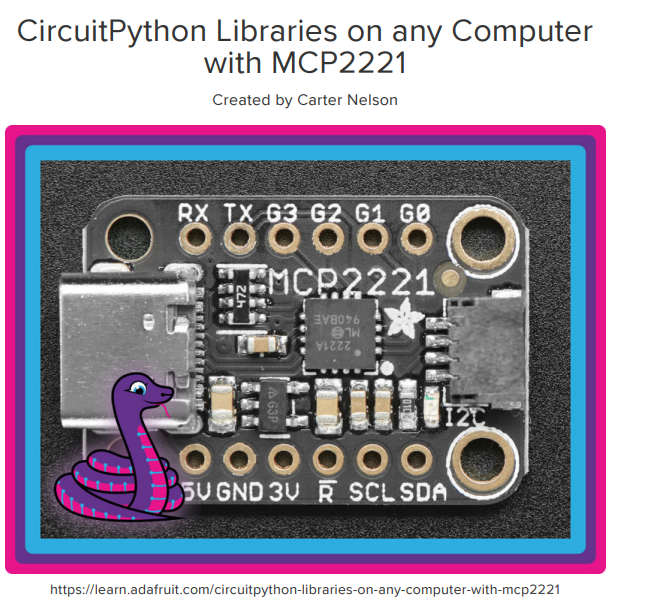

### MCP2221

<br/>
<center>
</img>
</center>


### 참조 링크

https://cdn-learn.adafruit.com/downloads/pdf/circuitpython-libraries-on-any-computer-with-mcp2221.pdf

### 1. Install

```
    pip3 install adafruit-circuitpython-lis3dh hidapi adafruit-blinka

    export BLINKA_MCP2221="1"
    echo $BLINKA_MCP2221
    >>>
    1

```

#### 1.1 check

```python
    import board
    dir(board)
```

good!

### 2. example


#### 2.1 board.d6 설정 ? 에러남

https://learn.adafruit.com/adafruit-lis3dh-triple-axis-accelerometer-breakout/python-circuitpython#python-installation-of-lis3dh-library-2997958


```python
    import time
    import board
    import digitalio
    import adafruit_lis3dh
    i2c = board.I2C()
    int1 = digitalio.DigitalInOut(board.D6)  # Set this to the correct pin for the interrupt!
    lis3dh = adafruit_lis3dh.LIS3DH_I2C(i2c, int1=int1)
```

#### 2.2 

https://github.com/adafruit/Adafruit_Learning_System_Guides/tree/main/CircuitPython_Essentials

i2c 관련 파이썬 코드 동작 확인