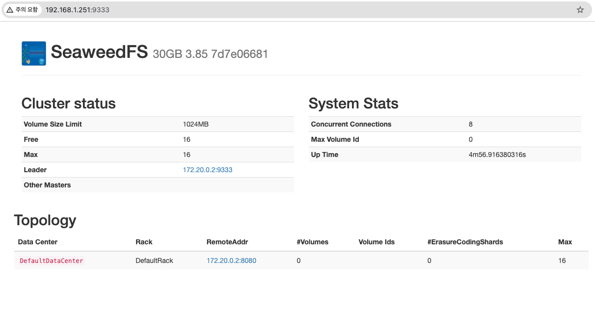
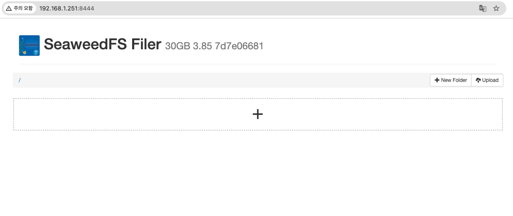

## 0. ref

## 1. memo

- docker-compose.yml 을 다음과 같이 작성하는 형태로해서
- frontend 앱과 backend, seaweedfs를 연동하는 예제로 작성

```yml
services:
  frontend:
    build: ./frontend
    ports:
      - "3000:3000"
    volumes:
      - ./frontend:/app
    depends_on:
      - backend

  backend:
    build: ./backend
    ports:
      - "8000:8000"
    volumes:
      - ./backend:/app
    environment:
      - SEAWEED_ENDPOINT=http://seaweedfs:8444
      - S3_ENDPOINT=http://seaweedfs:9000
      - S3_ACCESS_KEY=seaweed
      - S3_SECRET_KEY=seaweed
    depends_on:
      - seaweedfs

  seaweedfs:
    image: chrislusf/seaweedfs:3.85
    container_name: seaweedfs
    ports:
      - "9333:9333"     # master UI
      - "8444:8444"     # filer UI (📍 이거 추가!)
      - "9000:9000"     # S3-compatible endpoint
    volumes:
      - seaweed-master:/data/master
      - seaweed-volume:/data/volume
      - seaweed-filer:/data/filer
    command: |
      server -filer -s3 -filer.port=8444

volumes:
  seaweed-master:
  seaweed-volume:
  seaweed-filer:
```

- 최초 seaweedfs 만 실행하여, 동작 확인

```bash
docker-compose up -d --build seaweefs
```

- 다음 모두 접속 되야함.
    - http://localhost:9333 # 접속1
    - http://localhost:8333 # 접속2

- http://localhost:9333 # 접속1


- http://localhost:8333 # 접속2



- 그리고 '⚠️ 처음엔 수동으로 versioned-files 버킷 하나 만들어줘야 함' 라고함.
    - 1. aws-cli 를 이용하는 방법
    ```
        가장 빠른 방법: aws-cli로 만들기

        1️⃣ aws-cli 설치되어 있어야 해
        macOS: brew install awscli
        Ubuntu: sudo apt install awscli
        Windows: https://docs.aws.amazon.com/cli/latest/userguide/install-cliv2.html

        2️⃣ S3 endpoint 구성
        aws configure --profile seaweedfs
        AWS Access Key: seaweed
        AWS Secret Key: seaweed
        Region: us-east-1 (아무거나 가능)
        Output format: json
        
        3️⃣ 버킷 생성
        aws --profile seaweedfs \
            --endpoint-url http://localhost:9000 \
            s3 mb s3://versioned-files
        🔍 결과 확인
        aws --profile seaweedfs \
            --endpoint-url http://localhost:9000 \
            s3 ls
    ```
    - 2. python boto3을 이용하는 방법
    ```
        ✅ 대안: Python (boto3)으로도 가능

        import boto3

        s3 = boto3.client(
            "s3",
            endpoint_url="http://localhost:9000",
            aws_access_key_id="seaweed",
            aws_secret_access_key="seaweed",
        )

        s3.create_bucket(Bucket="versioned-files")
    ```
    - 3. seaweedfs의 Filer UI를 이용하는 방법
    ```
        ✅ Filer UI로 직접 생성 (📂 8333 포트에서 접근 가능)

        브라우저에서: http://localhost:8333
        빈 영역 우클릭 → New Directory
        이름: versioned-files
        ⚠️ 이건 내부 Filer용 디렉토리 생성이고, S3 클라이언트가 아닌 경우에만 유효함.
    ```

- 위와 같이 방법 3가지 중 편한 방법으로 생성.


