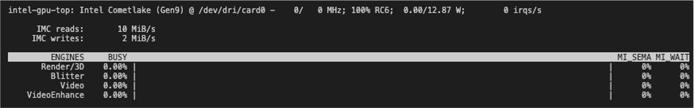

## 0. ref

https://askubuntu.com/questions/387594/how-to-measure-gpu-usage


## 1. gpu usage check

### 1.1  Intel GPU

```bash
    sudo apt-get install intel-gpu-tools 

    sudo intel_gpu_top

    >>>
    (다음 이미지와 같은 결과 )
```




### 1.2 python gpustat (NVIDIA device 필요) 

https://github.com/wookayin/gpustat

```bash
    pip install gpustat

    gpustat

    >>>
    Error on querying NVIDIA devices. Use --debug flag to see more details.
    Driver Not Loaded
```

### 1.3 nvtop (?)

```bash
    sudo apt install nvtop

    nvtop

    >>>
    No GPU to monitor.
```

### 1.4 nvidia-smi (NVIDIA device 필요)

테스트 PC에 nvida 그래픽카드가 없는데..

```bash
    nvidia-smi -l 2

```

### 1.5 그 외 ..

https://boysboy3.tistory.com/m/183